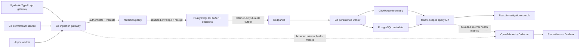
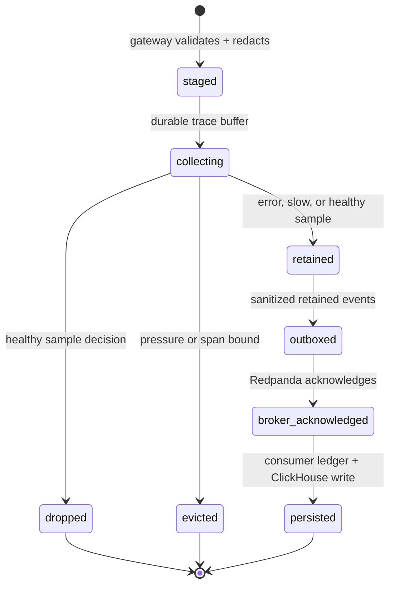
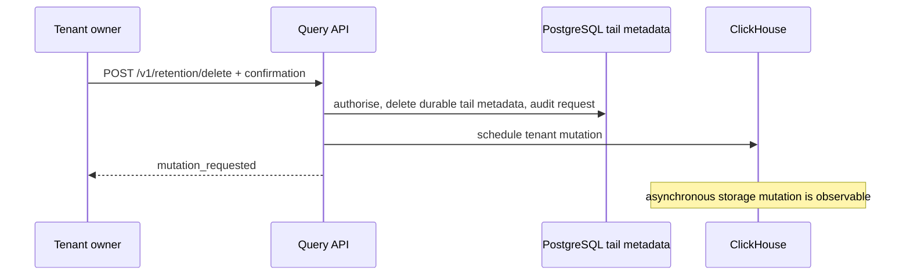

# Architecture

The gateway accepts bounded OTLP/HTTP JSON traces and logs. It acknowledges an
request only after every span/log record has been validated and its sanitized
envelopes are durably written as one PostgreSQL transaction to the tail buffer.
Redaction happens before that boundary. The tailer retains error
and slow traces, deterministically samples healthy traces, and records every
retain/drop/pressure decision without content. Retained data reaches Redpanda
through a durable outbox. The persistence worker deduplicates event identity
before ClickHouse storage. Trace-linked logs retain only their technical
trace/span IDs; unlinked logs remain tenant-scoped but are not shown in a trace
lookup. A downstream failure therefore yields retry or an explicit loss receipt
rather than silent success.

Raw telemetry is untrusted input and never reaches broker, storage, or logs before validation and redaction. PostgreSQL metadata and ClickHouse queries always include tenant scope.

The OpenTelemetry Collector is intentionally limited to internal HTTP outcome
metrics: it scrapes the gateway and query API and makes those bounded values
available to Prometheus/Grafana. It is not a tenant-telemetry ingest path; raw
telemetry enters only the authenticated redaction-first gateway.

## Durable tail decision state

The trace buffer and decision are PostgreSQL transactions. A tailer crash before
broker acknowledgement leaves the sanitized outbox item eligible for a later
lease. A crash after acknowledgement but before marking that outbox row can
duplicate broker delivery; the delivery ledger and deterministic event identity
make the ClickHouse-visible effect idempotent. Pressure eviction is not silently
discarded: it is recorded as a non-retained decision.

## Explicit retention deletion flow

The deletion endpoint removes this tenant's tail buffers, decisions, outbox
records, and tail event keys synchronously. It requests the ClickHouse mutation
separately because ClickHouse performs it asynchronously. The system never
reports that storage erasure is already complete merely because the request was
accepted.
