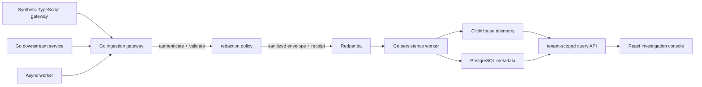

# Architecture

The gateway accepts bounded OTLP/HTTP JSON traces and logs. It acknowledges an
event only after its sanitized envelope is durably written to the broker.
Redaction happens before that boundary. The persistence worker deduplicates
event identity before ClickHouse storage. Trace-linked logs retain only their
technical trace/span IDs; unlinked logs remain tenant-scoped but are not shown
in a trace lookup. A downstream failure therefore yields retry or an explicit
loss receipt rather than silent success.

Raw telemetry is untrusted input and never reaches broker, storage, or logs before validation and redaction. PostgreSQL metadata and ClickHouse queries always include tenant scope.
